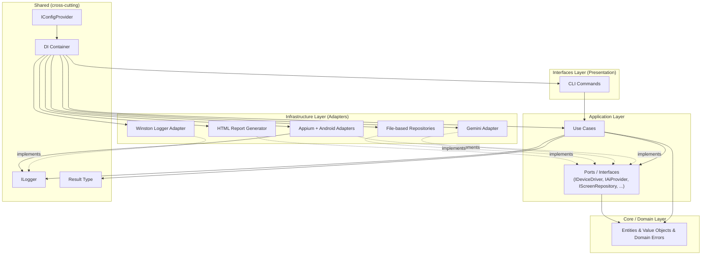
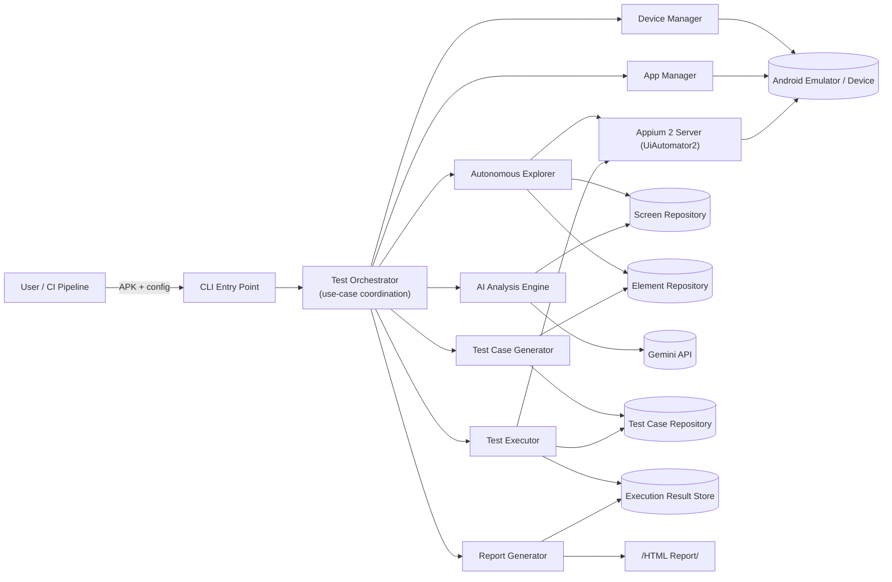
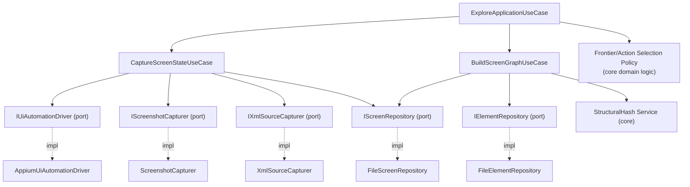
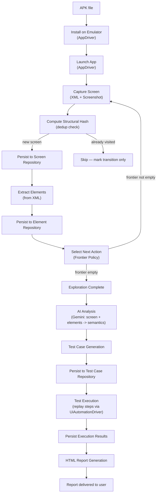
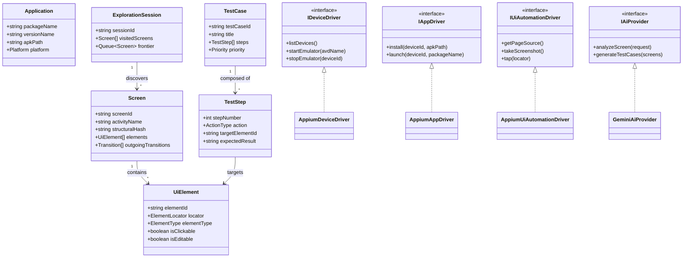
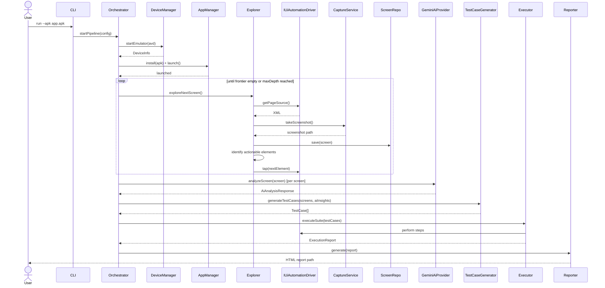

# AI-Powered Autonomous Mobile Testing Platform — Architecture (v0.1, Pending Approval)

Status: **DRAFT — not yet approved. No implementation has started.**
Scope of this document: architecture only, per POC scope (Android, simple apps: Calculator / Todo / Notes).

---

## 1. Complete Folder Structure

```
mobile-testing-platform/
├── .env.example
├── .eslintrc.json
├── .prettierrc
├── .gitignore
├── package.json
├── tsconfig.json
├── tsconfig.base.json
├── jest.config.ts
├── README.md
├── docs/
│   ├── ARCHITECTURE.md
│   ├── adr/                              # Architecture Decision Records (one file per decision)
│   │   ├── 0001-clean-architecture.md
│   │   ├── 0002-repository-pattern.md
│   │   └── 0003-ai-provider-abstraction.md
│   └── diagrams/
├── config/
│   ├── default.json
│   ├── development.json
│   ├── production.json
│   └── test.json
├── src/
│   ├── main.ts                           # entrypoint — delegates to bootstrap only
│   ├── bootstrap/
│   │   ├── container.ts                  # DI container wiring (composition root)
│   │   └── AppBootstrapper.ts            # startup sequence, config validation
│   ├── core/                             # DOMAIN layer — zero external dependencies
│   │   ├── entities/
│   │   │   ├── Application.ts
│   │   │   ├── Screen.ts
│   │   │   ├── UiElement.ts
│   │   │   ├── TestCase.ts
│   │   │   ├── TestStep.ts
│   │   │   ├── TestExecutionResult.ts
│   │   │   └── ExplorationSession.ts
│   │   ├── value-objects/
│   │   │   ├── ElementLocator.ts
│   │   │   ├── ScreenId.ts
│   │   │   ├── Coordinates.ts
│   │   │   └── DeviceCapabilities.ts
│   │   ├── errors/
│   │   │   ├── DomainError.ts
│   │   │   ├── DeviceNotFoundError.ts
│   │   │   ├── AppInstallationError.ts
│   │   │   └── ExplorationError.ts
│   │   └── enums/
│   │       ├── ElementType.ts
│   │       ├── Platform.ts
│   │       └── TestStatus.ts
│   ├── application/                      # USE-CASE layer — orchestrates domain via ports
│   │   ├── use-cases/
│   │   │   ├── device/
│   │   │   │   ├── StartEmulatorUseCase.ts
│   │   │   │   ├── StopEmulatorUseCase.ts
│   │   │   │   └── ListDevicesUseCase.ts
│   │   │   ├── app-management/
│   │   │   │   ├── InstallApplicationUseCase.ts
│   │   │   │   ├── LaunchApplicationUseCase.ts
│   │   │   │   └── UninstallApplicationUseCase.ts
│   │   │   ├── exploration/
│   │   │   │   ├── ExploreApplicationUseCase.ts
│   │   │   │   ├── CaptureScreenStateUseCase.ts
│   │   │   │   └── BuildScreenGraphUseCase.ts
│   │   │   ├── ai-analysis/
│   │   │   │   ├── AnalyzeScreenUseCase.ts
│   │   │   │   ├── GenerateTestCasesUseCase.ts
│   │   │   │   └── ClassifyElementUseCase.ts
│   │   │   ├── test-execution/
│   │   │   │   ├── ExecuteTestCaseUseCase.ts
│   │   │   │   └── ExecuteTestSuiteUseCase.ts
│   │   │   └── reporting/
│   │   │       └── GenerateReportUseCase.ts
│   │   ├── interfaces/                   # PORTS — contracts the domain needs from outside
│   │   │   ├── drivers/
│   │   │   │   ├── IDeviceDriver.ts
│   │   │   │   ├── IAppDriver.ts
│   │   │   │   └── IUiAutomationDriver.ts
│   │   │   ├── ai/
│   │   │   │   ├── IAiProvider.ts
│   │   │   │   └── IPromptBuilder.ts
│   │   │   ├── repositories/
│   │   │   │   ├── IScreenRepository.ts
│   │   │   │   ├── IElementRepository.ts
│   │   │   │   ├── ITestCaseRepository.ts
│   │   │   │   └── ITestResultRepository.ts
│   │   │   ├── capture/
│   │   │   │   ├── IScreenshotCapturer.ts
│   │   │   │   └── IXmlSourceCapturer.ts
│   │   │   └── reporting/
│   │   │       └── IReportGenerator.ts
│   │   └── dto/
│   │       ├── ExploreRequestDto.ts
│   │       ├── TestCaseDto.ts
│   │       └── ExecutionReportDto.ts
│   ├── infrastructure/                   # ADAPTERS — implement application ports
│   │   ├── appium/
│   │   │   ├── AppiumDeviceDriver.ts
│   │   │   ├── AppiumAppDriver.ts
│   │   │   ├── AppiumUiAutomationDriver.ts
│   │   │   └── AppiumSessionFactory.ts
│   │   ├── android/
│   │   │   ├── AdbClient.ts
│   │   │   ├── EmulatorManager.ts
│   │   │   └── AndroidCapabilitiesBuilder.ts
│   │   ├── ai/
│   │   │   └── gemini/
│   │   │       ├── GeminiAiProvider.ts
│   │   │       ├── GeminiPromptBuilder.ts
│   │   │       └── GeminiResponseParser.ts
│   │   ├── persistence/
│   │   │   ├── file-system/
│   │   │   │   ├── FileScreenRepository.ts
│   │   │   │   ├── FileElementRepository.ts
│   │   │   │   └── FileTestCaseRepository.ts
│   │   │   └── json/
│   │   │       └── JsonStore.ts
│   │   ├── capture/
│   │   │   ├── ScreenshotCapturer.ts
│   │   │   └── XmlSourceCapturer.ts
│   │   ├── reporting/
│   │   │   ├── HtmlReportGenerator.ts
│   │   │   └── templates/
│   │   │       └── report.hbs
│   │   └── logging/
│   │       └── WinstonLogger.ts
│   ├── interfaces/                       # PRESENTATION layer — thin entrypoints
│   │   ├── cli/
│   │   │   ├── commands/
│   │   │   │   ├── ExploreCommand.ts
│   │   │   │   ├── RunTestsCommand.ts
│   │   │   │   └── ReportCommand.ts
│   │   │   └── CliRunner.ts
│   │   └── http/                         # placeholder for future dashboard/API
│   ├── shared/                           # cross-cutting, framework-agnostic
│   │   ├── logger/
│   │   │   └── ILogger.ts
│   │   ├── config/
│   │   │   ├── IConfigProvider.ts
│   │   │   └── EnvConfigProvider.ts
│   │   ├── di/
│   │   │   ├── Container.ts
│   │   │   └── tokens.ts
│   │   ├── result/
│   │   │   └── Result.ts                 # Result<T, E> pattern
│   │   └── utils/
│   └── types/
│       └── global.d.ts
├── test/
│   ├── unit/                             # mirrors src/, mocks all ports
│   ├── integration/                      # exercises real adapters (Appium/Gemini) behind flags
│   └── fixtures/
│       ├── apks/
│       └── xml-samples/
├── artifacts/                            # RUNTIME OUTPUT — gitignored
│   ├── screenshots/
│   ├── xml-dumps/
│   ├── screen-repository/
│   ├── element-repository/
│   ├── test-cases/
│   └── reports/
├── scripts/
│   └── setup-emulator.ts
└── logs/
```

---

## 2. Module Breakdown

| # | Module | Layer | Responsibility |
|---|--------|-------|-----------------|
| 1 | Device Management | Application + Infrastructure | Start/stop/list Android emulators & physical devices |
| 2 | App Lifecycle Management | Application + Infrastructure | Install / launch / terminate / uninstall APK |
| 3 | Autonomous Explorer | Application | Crawls the app graph, decides next action, builds screen graph |
| 4 | Capture | Application + Infrastructure | Captures XML page source + screenshots at each screen |
| 5 | Screen Repository | Application + Infrastructure | Persists/retrieves discovered screens (dedup via structural hash) |
| 6 | Element Repository | Application + Infrastructure | Persists/retrieves UI elements per screen with locators |
| 7 | AI Analysis Engine | Application + Infrastructure | Sends screen data to Gemini, interprets UI semantics |
| 8 | Test Case Generator | Application | Converts AI insight + screen graph into executable test cases |
| 9 | Test Case Repository | Application + Infrastructure | Persists generated/manual test cases |
| 10 | Test Executor | Application + Infrastructure | Replays test cases against the app via Appium |
| 11 | Reporting | Application + Infrastructure | Produces HTML report from execution results |
| 12 | Logging | Shared + Infrastructure | Structured, correlated logging across all modules |
| 13 | Configuration | Shared + Infrastructure | Environment-aware, validated configuration |
| 14 | DI / Bootstrap | Shared | Wires interfaces to implementations at startup |
| 15 | CLI | Interfaces | User-facing command surface for the whole pipeline |

Every module in rows 1–11 is exposed to the rest of the system **only** through an interface (port) declared in `application/interfaces`. Nothing outside `infrastructure/` is allowed to import a concrete adapter directly.

---

## 3. Dependency Diagram



**Rule enforced by this diagram (Dependency Inversion Principle):** arrows only ever point *inward* (toward Core) or *upward* into an abstraction. `infrastructure/` depends on `application/interfaces`, never the reverse. `core/` depends on nothing. Only `bootstrap/` (the composition root) is allowed to know about every concrete class at once.

---

## 4. High-Level Architecture



This is the same pipeline from the long-term vision, just named at the component level. Every box that touches an external system (Emulator, Appium server, Gemini API, file system) sits in `infrastructure/`; the `Orchestrator` and everything it directly calls sits in `application/`.

---

## 5. Low-Level Architecture

Decomposing the "Explore" stage as the representative example (Test Execution and AI Analysis follow the identical shape):



Key low-level rules:
- `ExploreApplicationUseCase` never calls Appium directly — it only calls `IUiAutomationDriver`.
- Screen identity/deduplication (`HashingService`) is pure domain logic with no I/O, so it is trivially unit-testable.
- The action-selection policy (what to tap next) is isolated in `FrontierPolicy` so the exploration *strategy* can evolve (BFS today, priority/AI-guided later) without touching capture or persistence code.

---

## 6. Interfaces (Ports)

These are the contracts the rest of the system is built against. Only signatures — no implementation yet.

```typescript
// application/interfaces/drivers/IDeviceDriver.ts
export interface IDeviceDriver {
  listDevices(): Promise<DeviceInfo[]>;
  startEmulator(avdName: string): Promise<DeviceInfo>;
  stopEmulator(deviceId: string): Promise<void>;
  isDeviceReady(deviceId: string): Promise<boolean>;
}

// application/interfaces/drivers/IAppDriver.ts
export interface IAppDriver {
  install(deviceId: string, apkPath: string): Promise<void>;
  uninstall(deviceId: string, packageName: string): Promise<void>;
  launch(deviceId: string, packageName: string, activity?: string): Promise<void>;
  terminate(deviceId: string, packageName: string): Promise<void>;
  isInstalled(deviceId: string, packageName: string): Promise<boolean>;
}

// application/interfaces/drivers/IUiAutomationDriver.ts
export interface IUiAutomationDriver {
  getPageSource(): Promise<string>;
  takeScreenshot(): Promise<Buffer>;
  tap(locator: ElementLocator): Promise<void>;
  sendKeys(locator: ElementLocator, text: string): Promise<void>;
  swipe(direction: SwipeDirection): Promise<void>;
  back(): Promise<void>;
  getCurrentActivity(): Promise<string>;
}

// application/interfaces/ai/IAiProvider.ts
export interface IAiProvider {
  analyzeScreen(request: AiAnalysisRequest): Promise<AiAnalysisResponse>;
  generateTestCases(screens: Screen[]): Promise<TestCase[]>;
}

// application/interfaces/repositories/IScreenRepository.ts
export interface IScreenRepository {
  save(screen: Screen): Promise<void>;
  findById(screenId: string): Promise<Screen | null>;
  findByStructuralHash(hash: string): Promise<Screen | null>;
  findAllByApp(appPackage: string): Promise<Screen[]>;
}

// application/interfaces/repositories/IElementRepository.ts
export interface IElementRepository {
  save(element: UiElement): Promise<void>;
  findByScreenId(screenId: string): Promise<UiElement[]>;
}

// application/interfaces/repositories/ITestCaseRepository.ts
export interface ITestCaseRepository {
  save(testCase: TestCase): Promise<void>;
  findByAppPackage(appPackage: string): Promise<TestCase[]>;
}

// application/interfaces/repositories/ITestResultRepository.ts
export interface ITestResultRepository {
  save(result: TestExecutionResult): Promise<void>;
  findByRunId(runId: string): Promise<TestExecutionResult[]>;
}

// application/interfaces/reporting/IReportGenerator.ts
export interface IReportGenerator {
  generate(report: ExecutionReportDto): Promise<string>; // returns generated report path
}

// shared/logger/ILogger.ts
export interface ILogger {
  info(message: string, meta?: Record<string, unknown>): void;
  warn(message: string, meta?: Record<string, unknown>): void;
  error(message: string, error?: Error, meta?: Record<string, unknown>): void;
  debug(message: string, meta?: Record<string, unknown>): void;
  child(bindings: Record<string, unknown>): ILogger; // for run/session-scoped correlation
}

// shared/config/IConfigProvider.ts
export interface IConfigProvider {
  get<T>(key: string): T;
  getOrDefault<T>(key: string, defaultValue: T): T;
  validate(): void; // fail-fast on missing/invalid required keys
}
```

Every `infrastructure/` adapter implements exactly one of these; every `application/use-cases/*` file depends only on these, injected via constructor.

---

## 7. Folder Responsibilities

| Folder | Responsibility | May depend on |
|---|---|---|
| `src/core` | Pure domain: entities, value objects, domain errors, enums. No framework, no I/O. | nothing |
| `src/application` | Use cases (business workflows) + ports (interfaces) the domain needs from the outside world. | `core`, `shared` |
| `src/infrastructure` | Concrete adapters: Appium, ADB/emulator control, Gemini, file-based persistence, Winston, HTML templating. | `application` (interfaces only), `core`, `shared` |
| `src/interfaces` | Presentation: CLI today, HTTP API later. Thin — parses input, calls a use case, formats output. | `application`, `shared` |
| `src/shared` | Cross-cutting utilities usable anywhere: logger contract, config contract, DI tokens, `Result<T,E>`. | nothing outside itself |
| `src/bootstrap` | Composition root. The **only** place allowed to `import` a concrete infrastructure class and bind it to a port. | everything |
| `config/` | Environment-specific, non-secret configuration files. | — |
| `docs/` | Architecture docs, ADRs, diagrams. | — |
| `test/` | Unit tests (mirrors `src/`, mocks every port) and integration tests (real adapters, gated behind an env flag). | — |
| `artifacts/` | Runtime-generated output: screenshots, XML dumps, screen/element repositories, generated test cases, HTML reports. Gitignored. | — |
| `scripts/` | One-off developer/operational scripts (e.g., emulator bootstrap). | — |
| `logs/` | Winston file transport output. | — |

---

## 8. Data Flow



Concrete data artifacts produced at each stage:

| Stage | Artifact | Stored as |
|---|---|---|
| Capture | raw XML + PNG | `artifacts/xml-dumps/`, `artifacts/screenshots/` |
| Screen persistence | `Screen` JSON record | `artifacts/screen-repository/{screenId}.json` |
| Element persistence | `UiElement[]` JSON records | `artifacts/element-repository/{screenId}.json` |
| AI analysis | semantic annotations | attached to Screen/Element records, not stored separately |
| Test generation | `TestCase` JSON records | `artifacts/test-cases/{testCaseId}.json` |
| Execution | `TestExecutionResult` JSON | in-memory → passed to Reporter |
| Reporting | static HTML | `artifacts/reports/{runId}/index.html` |

---

## 9. Class Diagram



---

## 10. Sequence Diagram — "Explore, Generate, Execute" Pipeline



---

## 11. Design Decisions (and why)

1. **Clean / Hexagonal Architecture.** Business rules (what a "test case" is, how exploration decides what to tap next) must never depend on Appium, Gemini, or the file system. This is what lets the roadmap items (iOS, Flutter, React Native, cloud execution, swapping AI providers) become "add a new adapter" instead of "rewrite the core."
2. **Ports & Adapters, explicitly.** Every external dependency is declared as an interface under `application/interfaces` *before* any concrete implementation exists. This is why this phase produces interfaces and no code — the ports are the contract the whole team (and future modules) build against.
3. **Repository Pattern for all persistence.** Screens, elements, test cases, and results are accessed only via `IScreenRepository`, `IElementRepository`, etc. The POC implementation is flat JSON files; nothing about use cases changes if this becomes SQLite or a real database later.
4. **Dependency Injection via a composition root.** `bootstrap/container.ts` is the single place that maps interfaces to concrete classes. No file outside `bootstrap/` is allowed to instantiate a concrete infrastructure class directly — this is enforced by folder convention and can be enforced mechanically later with an ESLint boundary rule (e.g. `eslint-plugin-boundaries`).
5. **Result<T, E> for expected failures, exceptions for programmer errors.** "Element not found," "app not installed," "AI quota exceeded" are expected, recoverable outcomes and are modeled as `Result` values so callers are forced to handle them. Truly unexpected failures (null reference, bad config) still throw and are caught once, centrally, at the CLI boundary.
6. **Structural hashing for screen identity.** An autonomous crawler will reach the same logical screen via different navigation paths. Screens are deduplicated by a structural fingerprint of the element tree (ignoring volatile content like timestamps or counters), not by activity name or path — this keeps the screen graph from exploding into duplicates.
7. **AI provider abstraction (`IAiProvider`).** Gemini is the only implementation now, but nothing in `application/` mentions Gemini. Swapping providers, adding a second provider for comparison, or running fully offline with a stub implementation are all adapter-level changes.
8. **CLI is presentation-only.** `interfaces/cli` parses arguments and calls a use case — it contains no business logic. This is what makes adding an HTTP API / dashboard later additive rather than a rewrite: same use cases, new presentation adapter.
9. **Resumable exploration state.** Frontier queue + visited set are persisted incrementally (not just at the end), so a crashed or interrupted run can resume instead of restarting the whole crawl.
10. **Config validated eagerly ("fail fast").** `IConfigProvider.validate()` runs at boot and aborts immediately if `GEMINI_API_KEY` or other required settings are missing/invalid, rather than failing deep into a multi-minute exploration run.
11. **Structured, correlated logging.** Every run gets a `runId`; `ILogger.child({ runId })` threads that ID through every log line across every module so a single run's activity can be filtered out of shared log files.
12. **Domain events for exploration progress** (e.g. `ScreenDiscovered`, `ElementActionPerformed`). The Explorer publishes; Logger and Reporter subscribe. This avoids the Explorer needing to know Reporter or a future dashboard exist.

---

## 12. JSON Contracts

### Screen Repository Entry
```json
{
  "screenId": "string (uuid)",
  "appPackage": "string",
  "appVersion": "string",
  "activityName": "string",
  "title": "string | null",
  "screenshotPath": "string (relative path)",
  "xmlSourcePath": "string (relative path)",
  "structuralHash": "string",
  "elements": ["elementId", "..."],
  "discoveredFrom": {
    "screenId": "string | null",
    "action": {
      "type": "TAP | SWIPE | INPUT | BACK",
      "elementId": "string | null"
    }
  },
  "outgoingTransitions": [
    { "action": { "type": "TAP", "elementId": "string" }, "targetScreenId": "string" }
  ],
  "capturedAt": "ISO-8601 timestamp",
  "platform": "android | ios",
  "metadata": {}
}
```

### Element Repository Entry
```json
{
  "elementId": "string",
  "screenId": "string",
  "locators": {
    "resourceId": "string | null",
    "xpath": "string",
    "accessibilityId": "string | null",
    "className": "string",
    "text": "string | null",
    "contentDesc": "string | null"
  },
  "bounds": { "x": 0, "y": 0, "width": 0, "height": 0 },
  "elementType": "BUTTON | INPUT | TEXT | CHECKBOX | LIST_ITEM | IMAGE | UNKNOWN",
  "isClickable": true,
  "isEditable": false,
  "isScrollable": false,
  "aiClassification": {
    "semanticRole": "string, e.g. submit-button, search-input",
    "confidence": 0.0,
    "reasoning": "string"
  }
}
```

### Test Case Contract
```json
{
  "testCaseId": "string",
  "title": "string",
  "description": "string",
  "generatedBy": "AI | MANUAL",
  "preconditions": [],
  "steps": [
    {
      "stepNumber": 1,
      "action": "TAP | INPUT | SWIPE | ASSERT | WAIT | BACK",
      "targetElementId": "string | null",
      "inputValue": "string | null",
      "expectedResult": "string"
    }
  ],
  "priority": "HIGH | MEDIUM | LOW",
  "tags": ["smoke", "regression"]
}
```

### Execution Report Contract
```json
{
  "runId": "string",
  "appUnderTest": { "package": "string", "version": "string" },
  "startedAt": "ISO-8601",
  "completedAt": "ISO-8601",
  "summary": { "total": 0, "passed": 0, "failed": 0, "skipped": 0 },
  "results": [
    {
      "testCaseId": "string",
      "status": "PASSED | FAILED | SKIPPED | ERROR",
      "durationMs": 0,
      "stepResults": [
        {
          "stepNumber": 1,
          "status": "PASSED",
          "screenshotPath": "string",
          "errorMessage": "string | null"
        }
      ]
    }
  ]
}
```

### AI Provider Request/Response Contract
```typescript
interface AiAnalysisRequest {
  screenshotBase64?: string;
  xmlSource: string;
  context: {
    appName: string;
    previousScreens?: string[];
  };
}

interface AiAnalysisResponse {
  screenSummary: string;
  elements: Array<{
    locatorHint: string;
    semanticRole: string;
    confidence: number;
  }>;
  suggestedTestCases: TestCaseDto[];
}
```

---

## 13. Configuration Strategy

- **Layering:** `.env` (secrets: `GEMINI_API_KEY`, device farm tokens later) → `config/{environment}.json` (non-secret, environment-specific) → `config/default.json` (baseline). Env vars override file config; file config overrides defaults.
- **Access:** all config reads go through `IConfigProvider`, never `process.env` directly outside the `EnvConfigProvider` adapter — this keeps config access mockable in tests and swappable (e.g., to a remote config service later) without touching call sites.
- **Validation:** `IConfigProvider.validate()` runs once during `AppBootstrapper` startup and throws a fatal, descriptive error before any emulator/Appium/Gemini call is attempted if a required key is missing or malformed ("fail fast," not "fail three minutes into a crawl").
- **Secrets hygiene:** `.env` is gitignored; `.env.example` documents required keys with placeholder values; `GEMINI_API_KEY` and any token-shaped values are explicitly excluded from log output (see Logging Strategy).
- **Per-environment files:** `test.json` sets short timeouts and disables real AI calls (stubbed provider) for fast, deterministic Jest runs; `development.json` points at a local emulator; `production.json` (future) targets device-farm/cloud config.

---

## 14. Logging Strategy

- **Library:** Winston, behind the `ILogger` port — application/use-case code never imports Winston directly.
- **Format:** structured JSON in files (machine-parseable), human-readable colorized console output in development.
- **Correlation:** every pipeline run gets a `runId` (and exploration additionally gets a `sessionId`); `logger.child({ runId })` is handed to every use case for that run so all related log lines can be filtered/grepped together.
- **Transports & files:**
  - `logs/combined.log` — everything, `info` and above.
  - `logs/error.log` — `error` level only, for fast triage.
  - `logs/exploration.log` — dedicated stream for crawl progress (high volume, kept separate from execution logs).
  - Console transport (dev only) at `debug` level.
- **Levels:** `error` (unexpected/programmer faults), `warn` (expected-but-notable, e.g. retrying a flaky tap), `info` (pipeline milestones: screen discovered, test case generated), `debug` (raw XML/locator detail, off by default).
- **Redaction:** a Winston format strips known secret-shaped keys (`apiKey`, `token`, `authorization`) before anything is written, so a logged config object can never leak `GEMINI_API_KEY`.

---

## 15. Error Handling Strategy

- **Two-tier model:**
  - *Expected/recoverable* domain failures (element not found, app already installed, AI rate-limited) are returned as `Result<T, DomainError>` from use cases — the caller is statically forced to check `.isOk()` / `.isErr()` before proceeding.
  - *Unexpected/programmer* errors (null reference, malformed JSON, unhandled adapter exception) are allowed to throw and are caught exactly once, at the outermost boundary (`CliRunner`), which logs the full stack trace and exits non-zero.
- **Domain error hierarchy:** all expected errors extend `DomainError` (`DeviceNotFoundError`, `AppInstallationError`, `ExplorationError`, …) carrying a stable `code` for programmatic handling and reporting.
- **Retry policy:** infrastructure adapters (Appium calls specifically) wrap known-flaky operations (tap, get-page-source) in a bounded retry with backoff; retries are logged at `warn`, and exhausting retries surfaces as a `Result` failure, not a thrown exception — the use case decides whether that failure ends exploration of this branch or the whole run.
- **AI-call resilience:** Gemini calls are wrapped with a timeout + limited retry; on exhausted retries, `GenerateTestCasesUseCase` degrades gracefully (falls back to purely structural test generation without AI-suggested semantics) rather than failing the whole pipeline — logged as `warn`, surfaced in the final report as "AI analysis partially unavailable."
- **No swallowed errors:** every `catch` either rethrows, converts to a `Result` failure, or logs at `error` — never a silent empty catch block.

---

## 16. Future Extensibility Strategy

| Roadmap item | How this architecture accommodates it |
|---|---|
| **iOS support** | New adapters implementing existing ports: `XcuiDeviceDriver`, `XcuiAppDriver`, `XcuiUiAutomationDriver` (implements `IUiAutomationDriver`). Zero changes to `core/` or `application/use-cases`. |
| **Flutter / React Native apps** | New capture/element-classification adapters that read the semantics tree instead of the native XML view hierarchy, still producing the same `Screen`/`UiElement` domain shapes. |
| **Cloud execution (device farms)** | A `CloudDeviceDriver` implementing `IDeviceDriver`/`IAppDriver` against BrowserStack/Sauce Labs/Firebase Test Lab APIs — the Orchestrator and use cases are unaware whether a device is local or remote. |
| **Swapping/adding AI providers** | Add `OpenAiProvider` / `ClaudeProvider` implementing `IAiProvider`; select via config. Enables A/B-comparing providers without touching test generation logic. |
| **REST API / Web Dashboard** | Add `src/interfaces/http`, calling the *same* use cases the CLI calls today. Presentation-layer addition only. |
| **Parallel/distributed execution** | `ExecuteTestSuiteUseCase` is written against `IUiAutomationDriver` per session; a worker-pool adapter can fan out multiple sessions without changing use-case logic. |
| **Self-healing locators** | Extend `IElementRepository`/`AiAnalysisResponse` to store multiple ranked locator strategies per element; `AppiumUiAutomationDriver` tries them in order — additive, no interface break. |
| **Database-backed repositories** | Swap `FileScreenRepository`/etc. for `PostgresScreenRepository` implementing the same `IScreenRepository` — no use-case changes. |
| **Plugin-style test strategies** | Frontier/action-selection policy is already isolated (§5); new strategies (AI-guided prioritization, coverage-driven) register as alternative implementations selected via config. |

---

## Open Decisions Requiring Your Approval

Per "do not make assumptions," these are called out explicitly rather than decided silently:

1. **DI mechanism:** a lightweight hand-rolled token/factory container (`shared/di/Container.ts`, no decorators, no `reflect-metadata`) vs. a library (`tsyringe` or `InversifyJS`, decorator-based, more conventional in enterprise TS but adds a dependency + `reflect-metadata` polyfill). Recommendation: hand-rolled container for the POC — fewer moving parts — with a documented upgrade path to `tsyringe` if the team wants decorator ergonomics later.
2. **Runtime schema validation:** the tech stack list doesn't include a validation library. Recommendation: add `zod` (small, TS-first) to validate JSON contracts (§12) and config at the system boundary — this is the concrete mechanism behind "fail fast" in §13/§15. Flagging before adding any dependency not in your original list.
3. **POC persistence:** flat JSON files per repository (as designed above) vs. embedded SQLite from day one. Recommendation: flat JSON for the POC (matches "simple apps, no infra"), since the Repository Pattern makes swapping to SQLite a contained, later change.
4. **Monorepo tooling:** single package (as structured above) vs. Nx/Turborepo workspaces now, anticipating iOS/reporting-dashboard as separate packages later. Recommendation: single package now; revisit once a second deployable (e.g., the dashboard) actually exists.

---

## Approval Gate

**No implementation, Appium code, or crawler logic has been written.** This document defines structure, contracts, and decisions only.

Please review and confirm before we proceed:
- Approve the folder structure and layering as-is, or request changes.
- Decide the four open items above (or approve the stated recommendations).
- Confirm the module to implement first once approved (recommended order: `shared` primitives → `core` entities → `application` ports → `bootstrap`/DI wiring → first infrastructure adapter, likely `EnvConfigProvider` + `WinstonLogger` since every other module depends on them).

I will not generate code until you approve this architecture.
